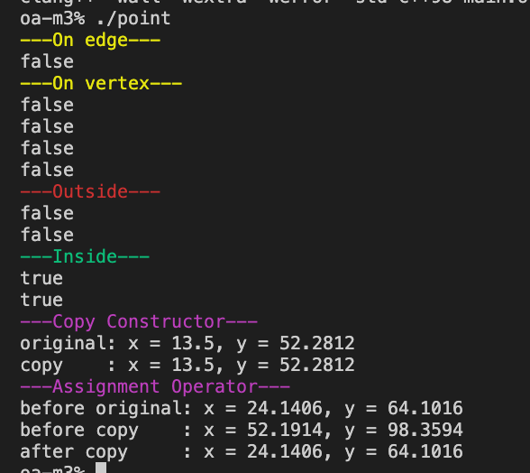

Бонусное задание модуля.
Создал класс Point с полями типа Fixed (число с фиксированной точкой) x, y.

И реализовал функцию которая принемает на вход 4 экземпляра класса Point. Три из которых обозначают вершины треугольника а 4-ая точку.
Функция возвращает true в случае если точка находится внутри треугольника и false во всех остальных случаях.

Класс Point так же имеет свои конструктор, дефолтный конструктор, конструктор копирования, перегрузка оператора "=" и деструктор.

в main.cpp находятся все тестовые кейсы.

Сборка: `make`

Запуск: `./point`

