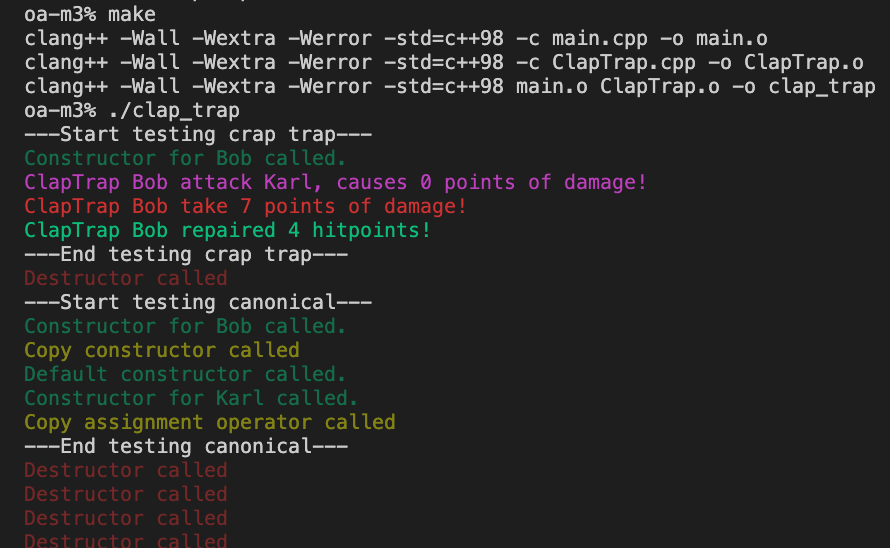

Создаем класс ClapTrap с полями name, hp(жизни), mp(очки манны), danage(уровень атаки).

Создал с соблюдением ортадоксальной канонической формы.
Есть конструктор, дефолтный конструктор, конструктор копирования, перегрузку оператора "=" и деструктор.

Сборка: `make`

Запуск: `./clap_trap`

