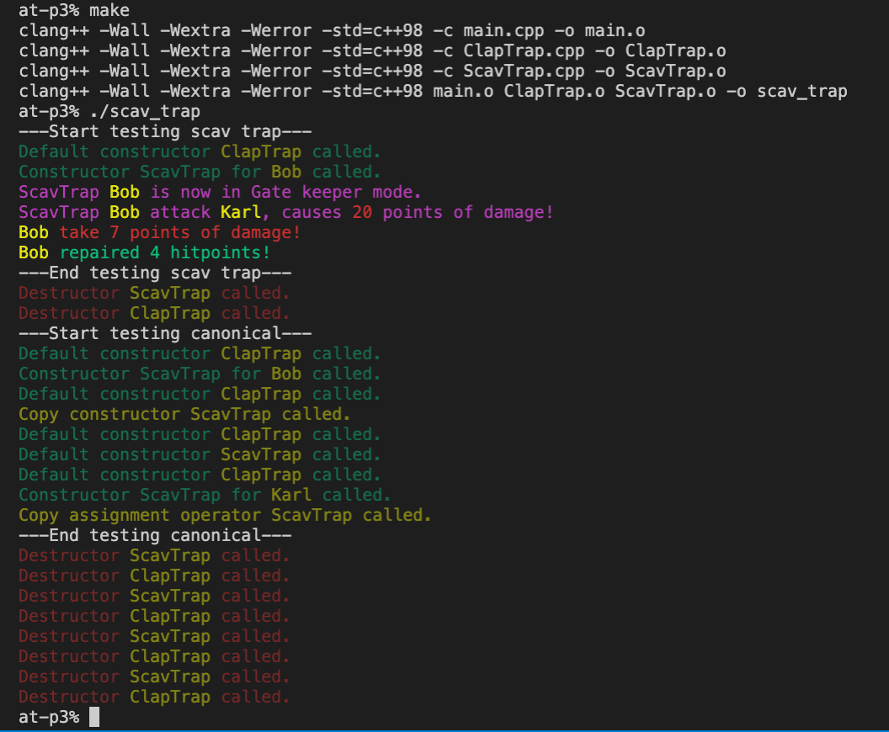

Создаел класс ScavTrap унаследовав его от класса ClapTrap из предыдущего задания.

Добавил метод guardGate(), переопределил метод attack из родительского класса.
Создал для него собственный конструктор, дефолтный конструктор, конструктор копирования, перегрузку оператора "=" и деструктор.

Сборка: `make`

Запуск: `./scav_trap`

