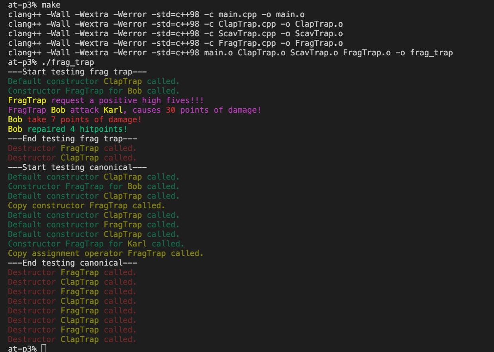

Создаел класс FragTrap унаследовав его от класса ClapTrap из предыдущих заданий.

Добавил метод highFivesGuys(), переопределил метод attack из родительского класса.
Создал для него собственный конструктор, дефолтный конструктор, конструктор копирования, перегрузку оператора "=" и деструктор.

Сборка: `make`

Запуск: `./frag_trap`

