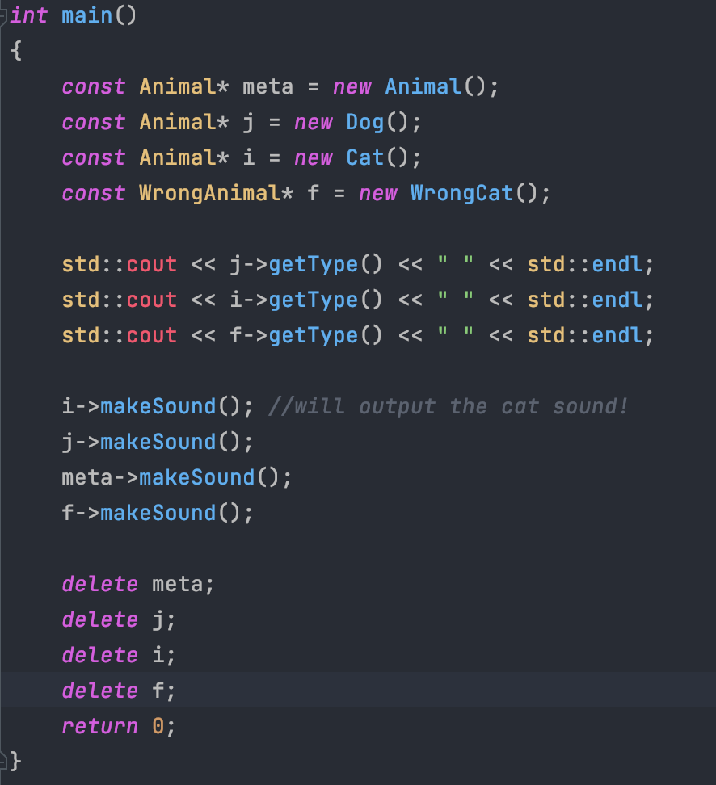
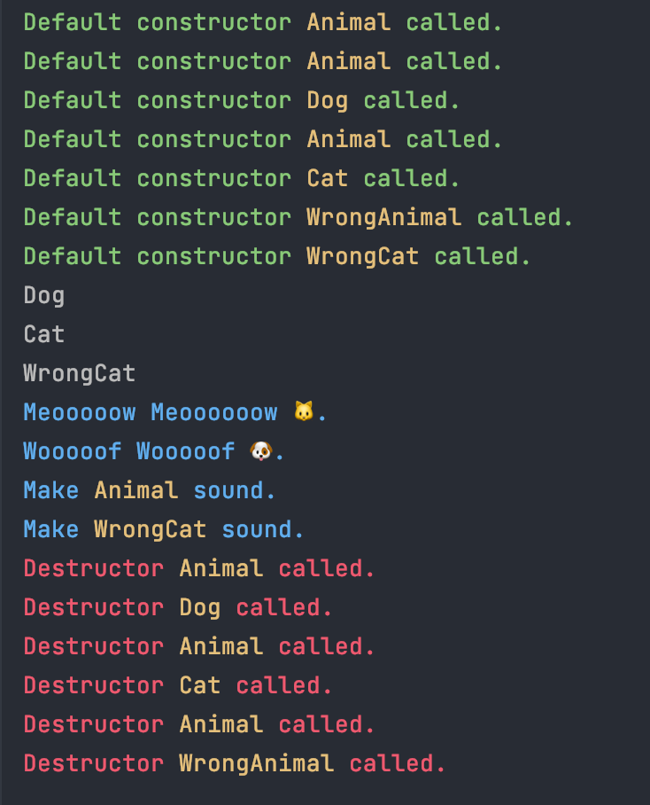

Продолжаем тему наследования сделал класс Animal от него унаследовались классы Cat и Dog.

Также сделал неправильный класс WrongAnimal и унаследовал от него класс WrongCat.

Показательный main со сценарием показывающем неверное поведение экземпляра класса при неверноей расстановке атрибутов.

Сборка: `make`

Запуск: `./animal`

main:

output:

