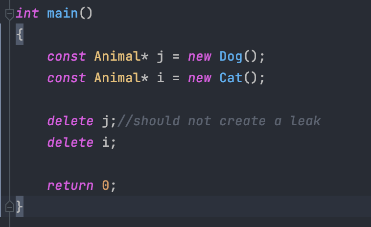

Создал класс Brain и добавил атрибут типа *Brain (указатель на экземпляр класса) классам из предыдущего упражнения Cat и Dog.

В конструкторах Cat и Dog создаем новый объект типа Brain и привязываем к нему указатель из атрибута.

В деструкторах Cat и Dog удаляю объект по ссылке. Таким образом память не утекает.

Сборка: `make`

Запуск: `./animal`

main:

output:

valgrind output (показывает отсутствие утечек памяти):

