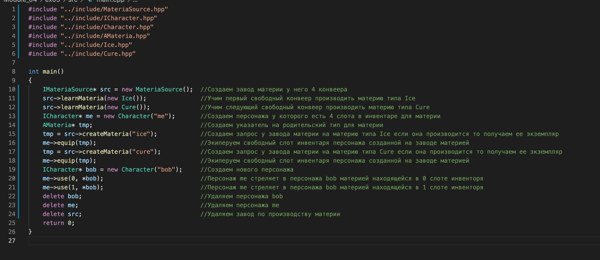

В этом задании мы описываем сложную структуру из классов, абстрактных классов и интерфесов.

Абстрактный класс AMateria будет являться родительским, для классов Ice и Cour.

Два класса интерфейса ICharackter и IMateriaSourse. И два соответсвенно унаследованные от них класса Charackter и MateriaSourse.

Charackter - пресонаж который имеет приватное поле с массивом из 4-ех указателей на объекты типа AMateria (так как этот класс абстрактный подразумевается любой его наследник в нашем слуае Ice или Cour).

MateriaSourse - завод по производству материи у которого также есть приватное поле с массивом из 4-ех указателей на объекты типа AMateria, но обозначают они конвееры этого завода. (Например если конвеер типа  Ice то этот конвеер производит этот тип материи)

Сборка: `make`

Запуск: `./materia`

