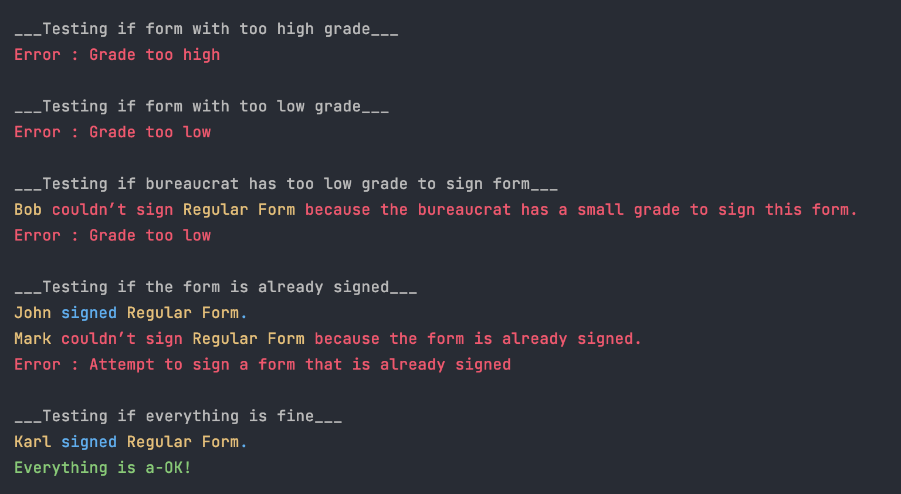

В этом задании мы создаем класс Bureaucrat с двумя приватными полями string _name, int _grade.
_grade - уровень бюрократа не может быть больше 1 и меньше 150 (1 уровень самый большой, 150 самый маленький).
В ситуациях когда _grade выходит за пределы я бросаю (с помощбю ключевого слова throw) исключение описанное внутри класса, унаследованное от класса exeptin.
В вызывающей функции я ловлю эти исключения и обрабатываю.

Сборка: `make`

Запуск: `./bureaucrat`

