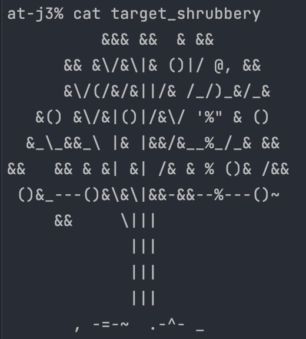
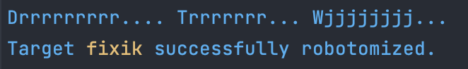
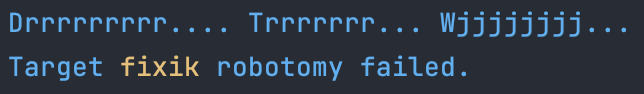
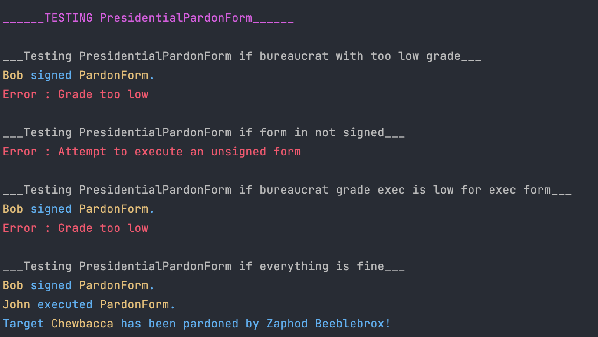

В этом задании я беру классы из предудущего задания (Bureaucrat и Form). 

Form делаю абстрактным классом AForm добавив функцию `execute(Bureaucrat const & executor)`.

Добавляю 3 новых класса ShrubberyCreationForm, RobotomyRequestForm, PresidentialPardonForm которые наследуются от абстрактного класса AForm.

У каждого из этх классов есть приватное поле `std::string _target` и переопределена функция `execute`, у каждого она будет выполнять разные действия.

ShrubberyCreationForm - будет создавать файл с именем `<target>_shrubbery` и рисовать в нем дерево символаси ASCII.

RobotomyRequestForm - в 50% случаев будет выводить сообщение об успешной роботизации цели `<target>` или о проваленной попытке роботизации цели `<target>`.

PresidentialPardonForm - выводит сообщение о том что цель `<target>` была помилована Зафодом Библброксом (персонажем из Автостопом по галактике) 

В классе AForm от которого наследуются эти три класса есть приватные поля `int _execution_grade` и `int _required_grade`.
Которые обозначают необходимый уровень бюрокарата (у класса Bureaucrat тоже есть поле `int _grade` обозначающее его уровень) для подписания формы и для ее выполнения соответственно.

Эти поля заполняются конструктором для каждого из трех классов (вызывая конструктор абстрактного класса с определенными параметрами).

Если бюрократ с недостаточным уровнем конкретной формы пытается подписать или выполнить ее, я пробрасываю исключение унаследованное от класса std::exeptin.

Сборка: `make`

Запуск: `./bureaucrat`
