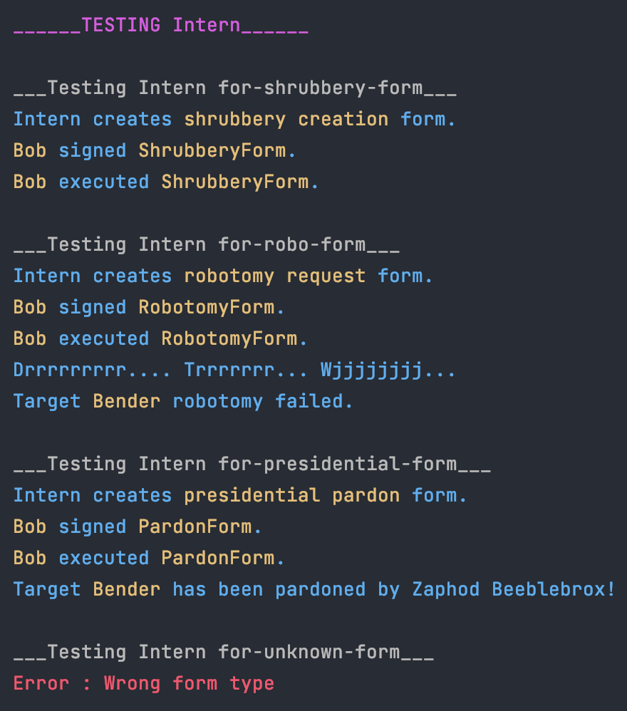

Поскольку заполнение форм достаточно раздражает, было бы жестоко просить наших бюрократов делать это целыми днями. К счастью, есть стажеры. В этом упражнении вам нужно реализовать класс Intern. У стажера нет ни имени, ни ранга, ни уникальных характеристик. Единственное, о чем заботятся бюрократы, это о том, чтобы они выполняли свою работу.

У интерна реализована функция makeForm() которая возвращает указатель но новую форму созданную с помощью ключевого слова new.

Таким образом ответственность за удаление объектов возвращенных этой функцией ложится польхователей класса Intern.

Если интерн получает аргументом тип формы которой не существует, он пробросит исключение.

Сборка: `make`

Запуск: `./bureaucrat`
