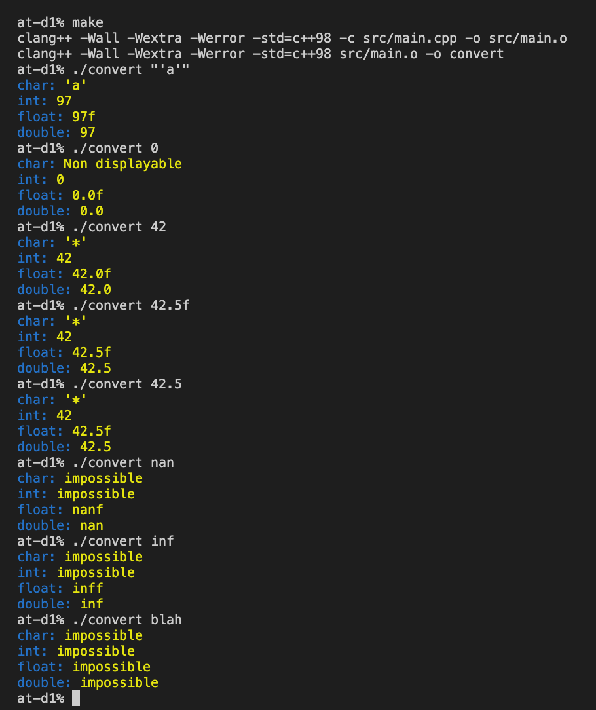

В данном задании я создаю программу `convert` которая принимает 1 аргумент и работает в 3 этапа.

1.Определить к какому типу принадлежит аргумент (поданный в виде строки) char `'a'`, int `42`, float `42.4f` или double `42.4`.

2.Конвертировать строку в тот же тип в котором подали аргумент.

3.Конвертировать из преобразованного типа в остальные 3 типа и вывести на экран.

Так как весь модуль делаю по стандарту C++98 то ограничен в выборе функций. 

Сборка: `make`

Запуск: `./convert`

