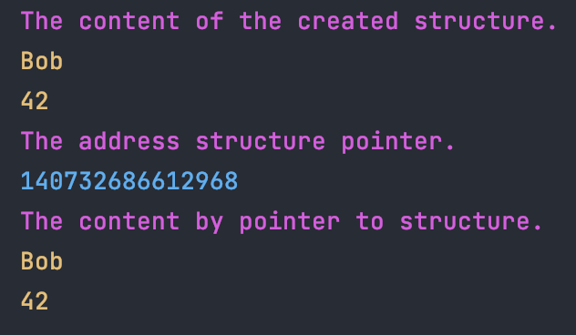

В этом задании я создаю две функции.

Одна принимает указатель на структуру и возвращает объект типа `uintptr_t` (uintptr_t является беззнаковым целочисленным memsize-типом и способен безопасно хранить в себе указатель в независимости от разрядности платформы)

Вторая принимает объект типа `uintptr_t` и возвращает указатель на структуру. 

Сборка: `make`

Запуск: `./serialize`

