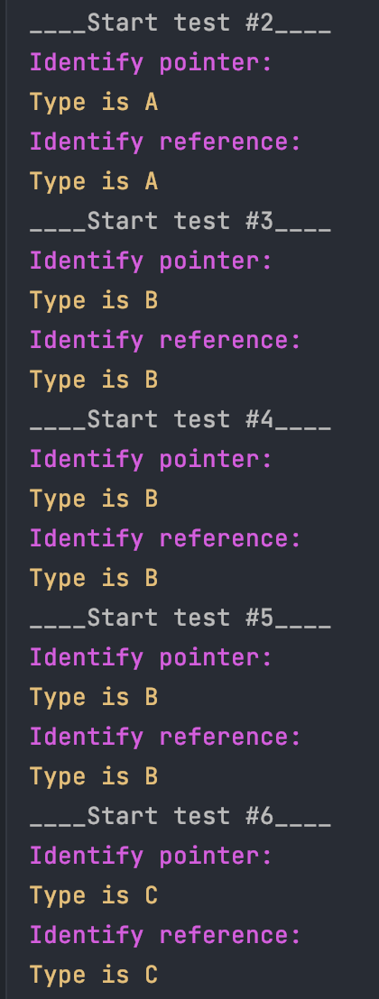

В этом задании я создаю класс Base и наследую от него 3 класса A, B и C.

Также я написал 3 функции:

1. `Base * generate(void);` - генерирует случайный экземпляр одного из трех классаов A, B или C. И возвращает его ввиде указателя на Base.

2. `void identify(Base* p);` - принимает аргументом укозатель на Base или его наследников A, B или C. Идентифицирует какому классу принадлежит экземпляр на который указывает указать `*p` и печатает этот тип.

3. `void identify(Base& p);` - принимает аргументом ссылку на Base или его наследников A, B или C. Идентифицирует какому классу принадлежит экземпляр на который указывает указать `&p` и печатает этот тип.

Так как мне запрещено было использовать функцию `std::typeinfo` я воспользовался `dynamic_cast`. 

Это функция, с помощью которой можно преобразовывать тип во время выполнения программы. Может применяться только к указателям или ссылкам.

Суть упражнения показать механизм RTTI (RTTI работает только для классов, имеющих виртуальные функции.)

RTTI — это механизм динамической идентификация типов (Run Time Type Identification — RTTI). 

Это обозначает, что типы объектов можно опознавать уже после компиляции и запуска программы. Многими устаревшими реализациями компиляторов С++ механизм RTTI не поддерживается. 

В некоторых компиляторах имеются опции, позволяющие включать или отключать RTTI.

Сборка: `make`

Запуск: `./identify`

