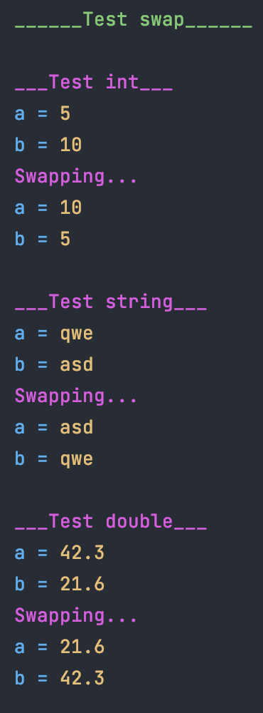
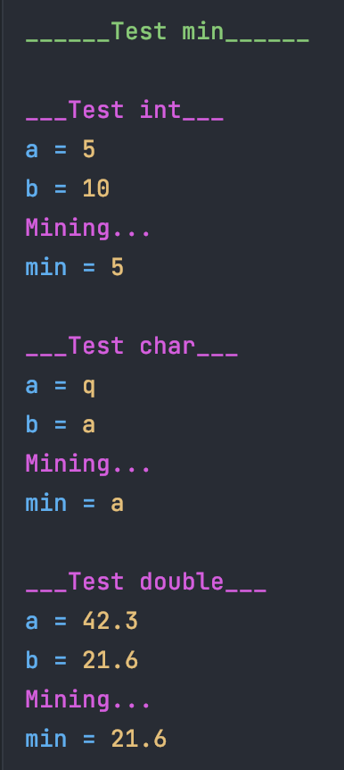
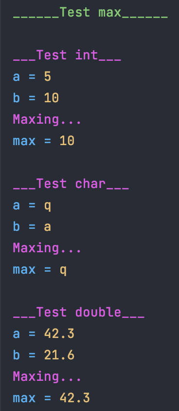

В этом задании я дожен написать 3 шаблонных функции `swap`, `min` и `max`.

Которые принимают два параметра одинакового типа, но какой тип заранее неизвестно, поэтому я и называю функции шаблонными.

Для реализации я использовал ключевое слово `template<typename T>`.

Сборка: `make`

Запуск: `./template`

 

