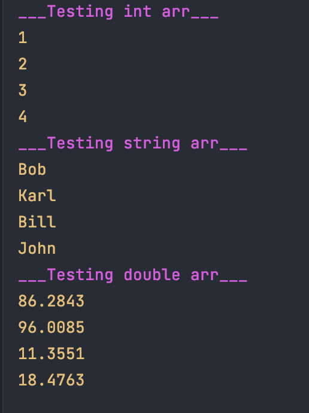

В этом задании я дожен написать функцию `iter`.

Она должна принемать 3 параметра:

1.Адресс массива любого типа.

2.Длина массива.

3.Указатель на функцию, которая будет вызываться для каждого элемента массива.

Прототип функции в результате получился таким `void iter(T *mas, size_t len, void (*f)(const T& item))`

Для теста написал простую функцию вывода на экран.

Сборка: `make`

Запуск: `./template`

