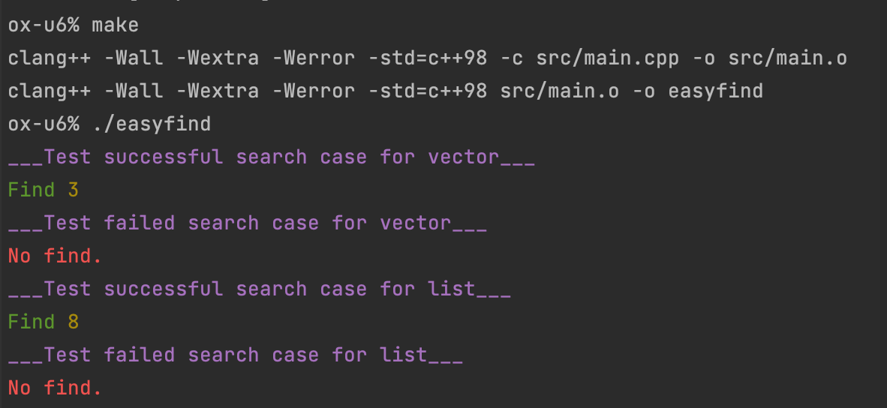

Создал шаблонную функцию `typename T::iterator easyfind (T &cont, int val)`.

Которая ищет первое вхождение элемента `val` типа `int` в контейнере любого типа.

Если элемент не найден пробрасывает исключение.

Сборка: `make`

Запуск: `./easyfind`

