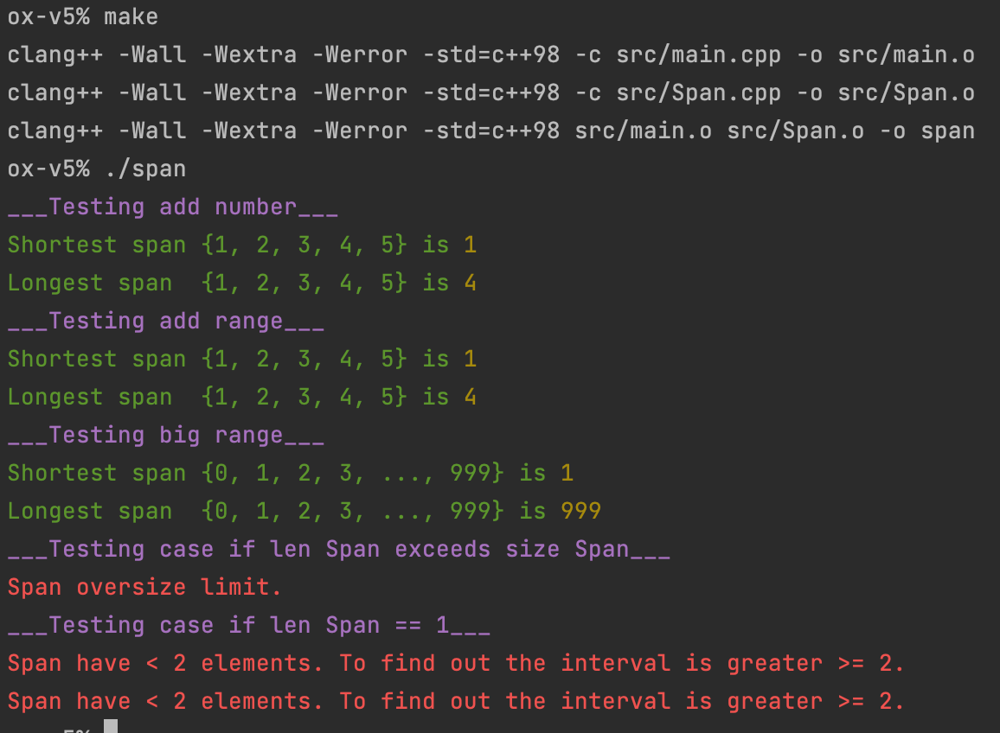

В этом задании создал класс Span. Конструктор которого принимает предельный размер контейнера в котором будут храниться переменные типа `int`.

Также реализовал 2 метода: `unsigned int longestSpan();` и `unsigned int shortestSpan();`.

Которые возвращают модуль числа означающего максимальную разницу между числами в контенере и минимальную соответственно.

Так же реализовал методы `void addNumber(int val);` и `	void addRange(list<int>::iterator begin, list<int>::iterator end);`.

Которые добавляют одно число в наш контейнер или диапазон чисел соответственно.

При привышении размера контейнера пробрасывается соответствующее исключение.

Сборка: `make`

Запуск: `./span`

