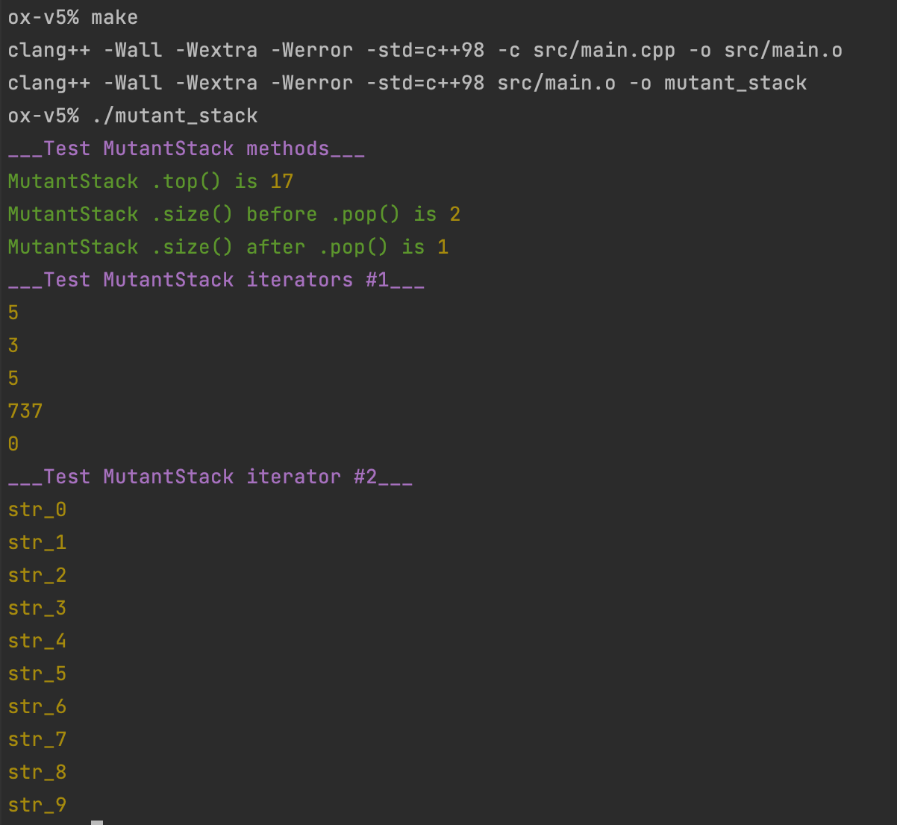

В этом задании я создаю класс `MutantStack` который наследуется от класса `std::stack`.

В оригинальном `std::stack` нету реализации итераторов.

Я в своем классе наследнике их реализовываю.

Сборка: `make`

Запуск: `./mutant_stack`

